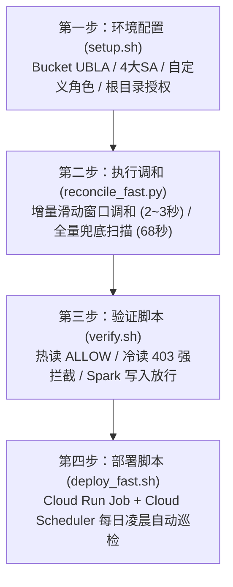

# GCS Managed Folder 热/冷数据分层与权限隔离方案：生产交付与部署手册

> **文档适用对象**：客户大数据平台架构师、SRE / DevOps 运维工程师、云安全管理员  
> **服务商**：Baidaodata 解决方案架构团队  
> **方案版本**：v2.1 (Dual-Mode Incremental & Full Reconcile Engine)  
> **代码仓库**：[https://github.com/GGSeven/gcs-managed-folder-poc.git](https://github.com/GGSeven/gcs-managed-folder-poc.git)

---

## 1. 方案背景与核心收益

客户大数据存储于 Google Cloud Storage (GCS) 上的 Iceberg 格式数仓，存储策略为 **60 天自动转入 Coldline 存储**。由于传统 SQL 引擎（如 Trino / Impala / Spark SQL）与交互式工具（Hue）由业务分析师或日常运维人员直接使用，曾发生由于未带分区过滤的全表扫描，误查数月至数年前的历史冷数据，触发高额的 **Coldline 冷数据检索费（Data Retrieval Fee）**。

### 核心收益与隔离目标
1. **0 元误查保底拦截**：分析人员或日常查询任务若误触 60 天前的历史冷数据，在 GCS 存储底层直接抛出 **`HTTP 403 Forbidden`** 强拦截，**冷数据检索量为 0，检索费用为 0**。
2. **读写管道完全解耦**：Spark / Flink 等写入引擎具备全库、全表、全生命周期读写权限，不受热冷流转状态影响，支持日常写入与冷历史分区 Compaction。
3. **Iceberg 元数据透明放行**：查询引擎随时可读取 Iceberg 的 `metadata/*.json`，以正常规划执行计划与分区裁剪，无论底层数据分区是否已被冷冻。
4. **极速自动化增量调和**：基于 Cloud Run Job Serverless 架构，采用滑动窗口增量调和技术，50+ 业务表日常增量调和仅需 **2.36 秒**（全量万级历史分区兜底仅需 **68 秒**）。
5. **绝对数据安全（零特权原则）**：调和引擎仅具备 GCS 控制面管理权限，**无任何数据读取权限（无 `storage.objects.get`）**，彻底杜绝运维工具触碰或泄露客户业务数据的合规风险。

---

## 2. 目录规范与服务账号（IAM）矩阵

### 2.1 目录结构标准规范
```text
gs://<BUCKET>/datasets/
  ├── <db_name>.db/
  │    └── <table_name>/
  │         ├── metadata/                         <-- 表级 Managed Folder (Hot/Cold Reader 均放行)
  │         │    └── v1.metadata.json
  │         └── data/
  │              ├── dt=2026-09-10/ (近60天热数据)  <-- 天级 Managed Folder (绑定 Hot Reader)
  │              │    └── data-00000.parquet
  │              └── dt=2026-04-12/ (60天前冷数据)  <-- 天级 Managed Folder (绑定 Cold Reader)
  │                   └── data-00000.parquet
```

### 2.2 服务账号（Service Accounts）权限矩阵

| 账号代号 | 账号命名示例 | 绑定范围与角色 | 业务职责说明 |
| :--- | :--- | :--- | :--- |
| **Writer SA** | `iceberg-writer@<PROJECT>.iam.gserviceaccount.com` | `datasets/` 根 Managed Folder: `roles/storage.objectUser` | Spark / Flink 写入管道，全生命周期可读写删 |
| **Hot Reader SA** | `iceberg-hot-reader@<PROJECT>.iam.gserviceaccount.com` | `metadata/`: `objectViewer`<br>`dt < 60d`: `objectViewer` | Hue / 日常报表 / 交互式查询引擎日常使用身份 |
| **Cold Reader SA** | `iceberg-cold-reader@<PROJECT>.iam.gserviceaccount.com` | `metadata/`: `objectViewer`<br>`dt >= 60d`: `objectViewer` | 历史归档数据调阅 / 审计专用通道（需审批使用） |
| **Reconciler SA** | `mf-reconciler@<PROJECT>.iam.gserviceaccount.com` | 自定义角色 `mfReconciler` (仅控制面，无对象读权限) | Cloud Run Job 调和引擎执行身份 |

---

## 3. 标准部署与交付四步流程



---

### 第一步：环境配置（Environment Setup）

本阶段完成 GCP 项目级前置准备：开启存储桶统一访问（UBLA）、配置 GCS 生命周期转换规则、创建 4 个专用服务账号、定义零特权自定义角色、初始化数据根目录 Managed Folder，并准备测试验证数据。

#### 1. 控制台操作路径（Console UI）
1. **统一存储桶级访问权限（UBLA）**：
   * 导航至：`Cloud Storage` -> `存储桶 (Buckets)` -> 选择目标存储桶 -> `权限 (Permissions)` 标签页。
   * 检查“访问权限控制”：必须设置为 **统一 (Uniform)**。如果不是，点击“切换为统一权限”。
2. **生命周期规则设置**：
   * 在存储桶页面选择 `生命周期 (Lifecycle)` 标签页 -> `添加规则`。
   * 操作：选择“将存储类别更改为 Coldline”，条件设置为“期限（天）: 60 天”。
3. **创建自定义最小权限角色（`mfReconciler`）**：
   * 导航至：`IAM & 管理` -> `角色 (Roles)` -> `+ 创建角色`。
   * 角色名称：`Managed Folder Reconciler`，角色 ID：`mfReconciler`。
   * 添加以下 7 项只读/控制面权限：
     * `storage.managedFolders.create`
     * `storage.managedFolders.get`
     * `storage.managedFolders.list`
     * `storage.managedFolders.getIamPolicy`
     * `storage.managedFolders.setIamPolicy`
     * `storage.objects.list`
     * `storage.buckets.get`
     * *(注：切勿勾选 `storage.objects.get`，确保调和引擎接触不到客户实际数据)*。
4. **创建 4 大服务账号**：
   * 导航至：`IAM & 管理` -> `服务账号 (Service Accounts)` -> `+ 创建服务账号`。
   * 分别创建：`iceberg-writer`、`iceberg-hot-reader`、`iceberg-cold-reader`、`mf-reconciler`。

#### 2. 一键自动化配置脚本
在本地终端或 Cloud Shell 中，克隆仓库并配置参数：
```bash
git clone https://github.com/GGSeven/gcs-managed-folder-poc.git
cd gcs-managed-folder-poc

# 编辑环境变量配置
cat << 'EOF' > config.env
export PROJECT_ID="<YOUR_PROJECT_ID>"
export REGION="<YOUR_REGION>"                  # 如 us-central1
export BUCKET="gs://<YOUR_BUCKET_NAME>"
export DATA_ROOT_PREFIX="datasets"
export HOT_DAYS=60
EOF

# 赋予执行权限并执行环境初始化
chmod +x *.sh *.py
./setup.sh
```

---

### 第二步：执行调和（Execution of Reconciliation）

调和引擎采用高效的 Python 原生 REST 连接池架构，直接与 GCS 控制面 API 通信，原生支持**双模运行机制**：

* **模式 A：增量滑动窗口模式 (`RECONCILE_MODE=incremental`，生产日常默认)**
  * **设计原理**：跳过对万级历史分区的扫描。仅对各表的 `metadata/`、今日/明日写入分区（`T+0`、`T+1`）、以及刚满 60 天的边界冷转分区（`T-60` ~ `T-62`）进行控制面下发。
  * **执行耗时**：50+ 张业务表仅需 **2.36 秒**，极速轻量，节省 98% 的 API 调用配额。
* **模式 B：全量兜底扫描模式 (`RECONCILE_MODE=full`，周度/月度审计校验)**
  * **设计原理**：多线程遍历数据仓库全量历史分区，校正因运维手动补数或历史操作遗留的任何权限偏移。
  * **执行耗时**：10,000+ 分区仅需 **68 秒**（处理吞吐达 140+ 分区/秒）。

#### 1. 本地/手动调和执行
在本地环境或运维中继机上运行调和引擎：
```bash
# 1. 以日常增量模式执行（耗时约 2~3 秒）
RECONCILE_MODE=incremental python3 reconcile_fast.py

# 2. 或以全量兜底模式执行（全量扫描 10000+ 历史分区，耗时约 68 秒）
RECONCILE_MODE=full python3 reconcile_fast.py
```

#### 2. 预期输出日志参考（增量模式）
```text
=========================================================================
🚀 启动高性能 Python 多线程调和引擎 (并发线程数: 30)
   项目: bd-host-2026-004 | 存储桶: bd-host-2026-004-mf-poc
   根目录: datasets/ | 隔离天数阈值: 60 天
=========================================================================
==> [1/3] 发现总数据库数: 7
  📁 数据库 [perf_10k.db]: 发现 50 张表
  📁 数据库 [ods.db]: 发现 1 张表
==> [2/3] 待处理数据表总计: 54 张
  ⚡ 启用【增量滑动窗口调和】模式 (免全量扫描，针对 T+0/T+1 增量热分区与 T-60 边界冷转)
     边界容错回溯: T-60 ~ T-62
==> [3/3] 增量调和任务总计: 324 项，启动 30 线程并发处理...
    进度: [50/324] 已处理...
    进度: [324/324] 已处理...
=========================================================================
🎉 调和完成！
   运行模式: INCREMENTAL
   处理分区/操作数: 324 个 (成功: 324)
   核心调和耗时: 2.36 秒 (平均处理速度: 137.3 操作/秒)
   全流程总耗时: 2.63 秒 ✔
=========================================================================
```

---

### 第三步：验证脚本（Verification & Assertion）

在权限调和生效后，必须通过模拟（Impersonate）各服务账号的真实访问行为，断言权限拦截与放行是否 100% 达到数仓安全预期。

#### 1. 执行自动化验证脚本
```bash
./verify.sh
```

#### 2. 自动化断言结果矩阵
验证脚本会自动对以下关键业务路径进行读写判定，全部为 `[PASS ✔]` 方可通过验收：

| 校验阶段 | 测试主体 (Impersonate SA) | 目标路径与场景 | 预期判定 | 业务安全与功能意义 |
| :--- | :--- | :--- | :---: | :--- |
| **[1/4] 元数据放行** | `iceberg-hot-reader` | `.../metadata/v1.metadata.json` | **ALLOW (200)** | 查询引擎可读取快照，SQL 解析正常规划 |
| | `iceberg-cold-reader` | `.../metadata/v1.metadata.json` | **ALLOW (200)** | 归档调阅引擎可读取元数据快照 |
| **[2/4] 分析端隔离** | `iceberg-hot-reader` | `.../data/dt=昨天/data-00000.parquet` | **ALLOW (200)** | 分析师正常查询近 60 天活跃业务数据 |
| | `iceberg-hot-reader` | `.../data/dt=65天前/data-00000.parquet` | **DENY (403)** | **误查冷数据底层强拦截，冷数据检索费为 0 元** |
| | `iceberg-cold-reader` | `.../data/dt=65天前/data-00000.parquet` | **ALLOW (200)** | 合规审计/离线专用通道正常调阅冷数据 |
| | `iceberg-cold-reader` | `.../data/dt=昨天/data-00000.parquet` | **DENY (403)** | 归档通道禁止越权访问热业务数据 |
| **[3/4] 写入管道** | `iceberg-writer` | `.../data/dt=昨天/` (读/写) | **ALLOW (200)** | Spark/Flink 正常流式或批处理写入新数据 |
| | `iceberg-writer` | `.../data/dt=65天前/` (读/写) | **ALLOW (200)** | 支持历史小文件治理（Compaction/Expire）重写 |
| **[4/4] 零特权安全** | `mf-reconciler` | 任意数据文件 (读) | **DENY (403)** | 运维调和身份接触不到业务数据内容 |

#### 3. 预期终端输出
```text
=========================================================================
🧪 开始执行权限隔离自动化断言测试 (Verification)
=========================================================================
--> [1/4] 验证 Iceberg 元数据放行 (Hot / Cold Reader 均必须可读)
  [PASS ✔] Hot Reader 读取 Iceberg metadata => 实际: ALLOW (符合预期)
  [PASS ✔] Cold Reader 读取 Iceberg metadata => 实际: ALLOW (符合预期)

--> [2/4] 验证查询分析端隔离 (Hue / 交互式查询：热数据放行，冷数据 403 强拦截)
  [PASS ✔] Hot Reader 正常读取热分区 => 实际: ALLOW (符合预期)
  [PASS ✔] Hot Reader 误查冷分区 (403 强拦截，0元检索费) => 实际: DENY (符合预期)
  [PASS ✔] Cold Reader 正常调阅冷分区 => 实际: ALLOW (符合预期)
  [PASS ✔] Cold Reader 越权访问热分区 (403 拦截) => 实际: DENY (符合预期)

--> [3/4] 验证写入端全生命周期权限 (Spark / Flink：冷热皆可读写与 Compaction)
  [PASS ✔] Writer SA 读取热数据 => 实际: ALLOW (符合预期)
  [PASS ✔] Writer SA 读取冷数据 (Compaction 规划) => 实际: ALLOW (符合预期)
  [PASS ✔] Writer SA 写入新热分区 => 实际: ALLOW (符合预期)
  [PASS ✔] Writer SA 重写历史冷数据 => 实际: ALLOW (符合预期)

--> [4/4] 验证调和引擎零特权原则 (Reconciler SA：只控权限，读不到数据)
  [PASS ✔] Reconciler SA 读取热数据 (无 objects.get) => 实际: DENY (符合预期)
  [PASS ✔] Reconciler SA 读取冷数据 (无 objects.get) => 实际: DENY (符合预期)
=========================================================================
🎉 恭喜！全部权限隔离与安全断言 100% 通过验证 ✔
```

---

### 第四步：部署脚本（Cloud Run Job + 定时调度）

在单次手动调和与验证通过后，将调和引擎固化为生产级云原生作业（Cloud Run Job），并通过 Cloud Scheduler 实现每日凌晨无人值守自动化滑动。

#### 1. 控制台操作路径（Console UI）
1. **构建与容器仓库（Artifact Registry）**：
   * 导航至：`Artifact Registry` -> `代码库 (Repositories)` -> `+ 创建代码库`。
   * 名称：`mf-poc`，格式：`Docker`，区域：与 GCS 所在区域严格一致（如 `us-central1`）。
2. **部署 Cloud Run Job**：
   * 导航至：`Cloud Run` -> `任务 (Jobs)` -> `+ 创建任务 (Create Job)`。
   * 任务名称：`mf-reconcile`。
   * 容器映射：选择构建生成的镜像。
   * 容器规格：`2 vCPU`，`1 GiB 内存`，`任务超时: 10 分钟`，`重试次数: 0`。
   * 服务账号：选择 `mf-reconciler@<PROJECT>.iam.gserviceaccount.com`。
   * 环境变量：设置 `RECONCILE_MODE=incremental`、`MAX_WORKERS=30`、`HOT_DAYS=60` 等。
3. **配置 Cloud Scheduler 定时调度**：
   * 导航至：`Cloud Scheduler` -> `+ 创建作业 (Create Job)`。
   * 名称：`mf-reconcile-daily`。
   * 频率：`5 0 * * *`（每天 UTC 00:05 / 对应北京时间 08:05）。
   * 目标类型：`HTTP`，网址填入 Cloud Run Job 的触发地址。
   * 认证标头：选择 `OAuth 令牌`，服务账号选择 `mf-reconciler`。

#### 2. 一键自动化部署脚本
在终端中执行：
```bash
./deploy_fast.sh
```

#### 3. 生产测试与日志查询
部署完成后，手动触发一次生产运行，并检查日志：
```bash
# 手动触发 Cloud Run 运行并等待其完成
gcloud run jobs execute mf-reconcile --region="<YOUR_REGION>" --wait

# 读取 Cloud Logging 运行日志
gcloud logging read 'resource.type="cloud_run_job" AND resource.labels.job_name="mf-reconcile"' \
  --limit=30 \
  --format="value(textPayload)"
```

---

## 4. 架构师前瞻性风险与避坑指南

### ⚠️ 陷阱一：Bucket 级 / Project 级权限污染（Additive IAM 穿透风险）
* **风险机制**：GCS Managed Folder 的 IAM 鉴权为**纯叠加（Additive）模式**，不支持显式 Deny。如果用户或服务账号在 **Bucket 级别** 或 **Project 级别** 被授予了 `roles/storage.objectViewer`，该权限会自动穿透所有 Managed Folder，导致 403 隔离完全失效！
* **架构避坑对策**：审计确认 `iceberg-hot-reader` 在 Bucket 级没有任何 `storage.objects.*` 绑定。其权限必须**严格自 `datasets/` 子目录下的 Managed Folder 逐层下发**。

### ⚠️ 陷阱二：跨日作业写入阻断（Midnight Write Window Gap）
* **风险机制**：如果定时任务在每天 00:05 执行，而 Spark/Flink 在 00:01 开始写入今天新分区 `dt=TODAY`，若该目录尚未创建 Managed Folder，写入是否会被阻断？
* **架构避坑对策**：
  1. **写入端天生放行**：`iceberg-writer` 在根目录 `datasets/` 上已持有 `roles/storage.objectUser`，原生具备向任何未创建 Managed Folder 的子路径直接写入对象的权限。
  2. **双天预建机制**：调和引擎每次运行都会自动预先创建今天（`offset=0`）与明天（`offset=1`）两个热分区 Managed Folder，留出充足的写入缓冲。

### ⚠️ 陷阱三：零特权控制面与 CLI 内部探测冲突（CLI objects.get 403）
* **风险机制**：原生 `gcloud storage managed-folders set-iam-policy` 命令行在设置策略前，会额外发起 `objects.get` 请求探测该路径是否对应实际存在的 GCS 对象。如果 Reconciler SA 严格遵循最小特权原则（不含 `objects.get`），CLI 会直接报错退出。
* **架构避坑对策**：生产调和必须采用本项目提供的 Python REST 连接池引擎（`reconcile_fast.py`），直接调用 GCS 控制面 API（`storage/v1/b/.../managedFolders/.../iam`），规避非必要的对象内容探测。

---

## 5. 客户实施前调研清单（Customer Discovery Checklist）

在正式向客户生产数仓交付前，架构师请与客户团队确认以下 4 个关键细节：

1. **数仓路径规范对齐**：
   * 确认各层数据库与表是否遵循规范：`datasets/<db_name>.db/<table_name>/data/dt=YYYY-MM-DD/`？
   * 是否存在特殊的多级分区（例如 `dt=YYYY-MM-DD/hh=XX/`）？如有，可直接在 `reconcile_fast.py` 的正则匹配器中扩展支持。
2. **生产作业凭据对接方式**：
   * 生产环境 Spark / Flink 任务当前是通过何种方式获取 GCS 凭据的（GKE Workload Identity、Compute Engine 默认服务账号、还是挂载的 Service Account Key）？
   * 确认将 Spark/Flink 的运行凭据绑定到 `iceberg-writer` 服务账号。
3. **Hue / Trino 查询代理凭据**：
   * 分析师使用的查询引擎（Trino / Impala / Presto / Hue）是以何种服务账号向 GCS 发起数据扫描的？
   * 确认将日常查询引擎的底层读取凭据指向 `iceberg-hot-reader`。
4. **排除不需要管理的临时库**：
   * 确认是否存在无需进行隔离的临时表库（如 `tmp.db`、`sandbox.db`），可在配置项 `EXCLUDE_DBS` 中添加，进一步减少不必要的管理开销。
